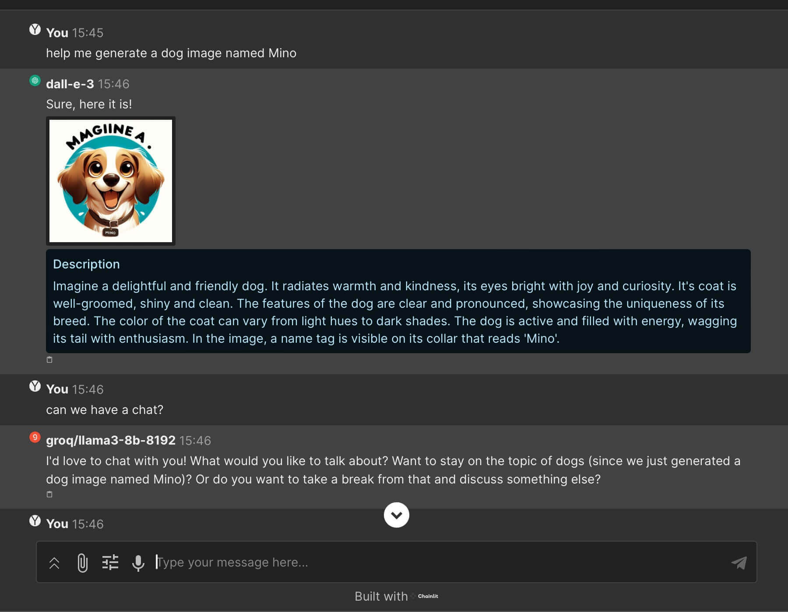

# VT.ai

<p align="center">
  <em>Multi-modal Large Language Models Chat Application</em>
</p>

[](https://opensource.org/licenses/MIT)

[](https://github.com/vinhnx)
[](https://news.ycombinator.com/user?id=vinhnx)
[](https://twitter.com/vinhnx)

---

## Introduction

VT.ai is a Python application that provides a user-friendly chat interface for interacting with Large Language Models (LLMs) from various providers. The application supports multi-modal conversations, allowing users to seamlessly integrate text, images, and vision processing in their interactions with the LLMs.

### Vision aware


### Multi LLM Providers Selection with LiteLLM


### Multi-modal Conversation Routing with SemanticRouter



---

## Key Features

-   **Multi-Provider Support:** Choose from a list of LLM providers, including OpenAI, Anthropic, and Google, with more to come.
-   **Multi-Modal Conversations:** Upload text and image files for a rich, multi-modal experience. You can drag and image and have the model explain it for you.
-   **Real-time Responses:** Stream responses from the LLM as they are generated.
-   **Dynamic Settings:** Various settings to choose from. TODO: Adjust model parameters such as temperature and top-p during the chat session.
-   **Clean and Fast Interface:** Built using Chainlit, ensuring a smooth and intuitive user experience.
-   **Advanced Conversation Routing:** Leveraging SemanticRouter for accurate and efficient modality selection.

## Getting Started

### Prerequisites

-   Python 3.7 or higher
-   Rye as the Python dependencies manager (installation guide below)

### Installation

1. Clone the repository: `git clone https://github.com/vinhnx/VT.ai.git` (optional: rename the cloned directory to `vtai`)
2. Navigate to the project directory: `cd vtai`
3. Install Rye (Python packages manager):
    ```
    curl -sSf https://rye-up.com/get | bash
    ```
4. Source the Rye env file to update PATH (add this to your shell configuration file, e.g., `.zprofile` or `.zshrc`):
    ```
    source "$HOME/.rye/env"
    ```
5. Start dependencies sync: `rye sync`
6. Activate the Python virtual environment: `source .venv/bin/activate`
7. Run the app: `chainlit run src/vtai/app.py -w`

### Usage

1. Rename the `.env.example` file to `.env` and configure your private LLM provider API keys.
2. Set up the required configuration files (`config.py` and `llm_profile_builder.py`) with your LLM models and settings.
3. Run the app with optional hot reload: `chainlit run src/vtai/app.py -w`
4. Open the provided URL in your web browser (e.g., `localhost:8000`).
5. Select an LLM model and start chatting or uploading files for multi-modal processing.

## Technical Overview

### Dependencies

-   [Chainlit](https://github.com/Chainlit/chainlit): A powerful library for building chat applications with LLMs, providing a clean and fast front-end.
-   [LiteLLM](https://github.com/BerriAI/litellm): A versatile library for interacting with LLMs, abstracting away the complexities of different providers.
-   [SemanticRouter](https://github.com/aurelio-labs/semantic-router): A high-performance library for accurate conversation routing, enabling dynamic modality selection.

### Contributing

Contributions are welcome! Here's how you can contribute:

1. Fork the repository
2. Create a new branch: `git checkout -b my-new-feature`
3. Make your changes and commit them: `git commit -m 'Add some feature'`
4. Push to the branch: `git push origin my-new-feature`
5. Submit a pull request

## License

This project is licensed under the MIT License.

## Contact

For questions, suggestions, or feedback, feel free to reach out:

-   Twitter: [@vinhnx](https://twitter.com/vinhnx)
